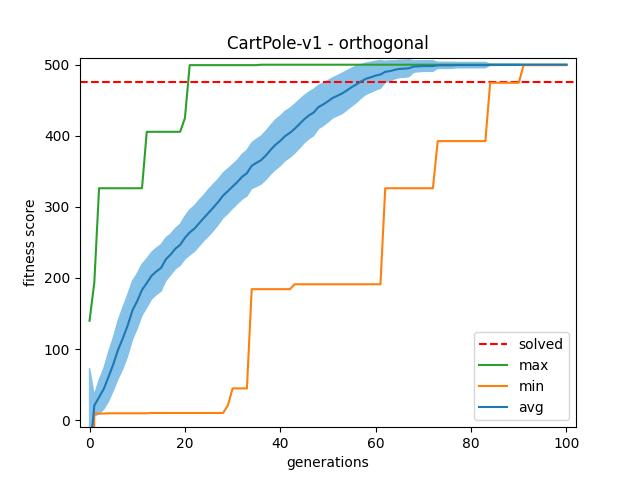
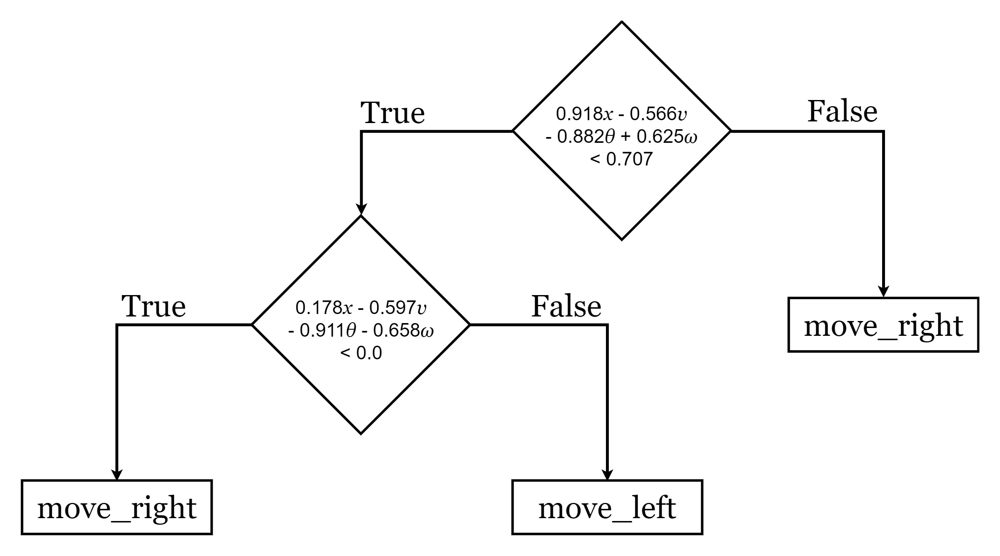
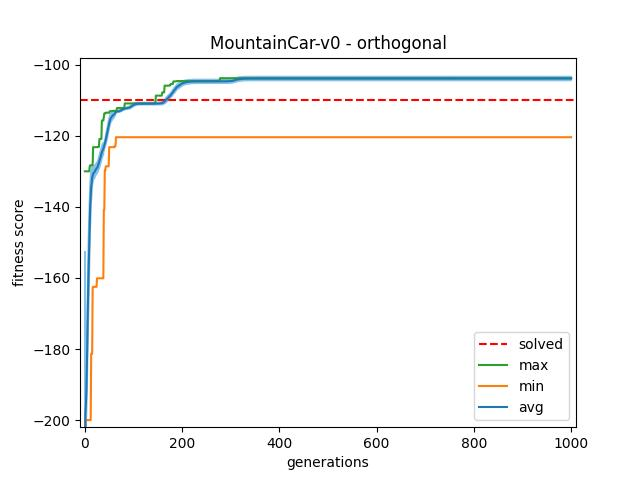
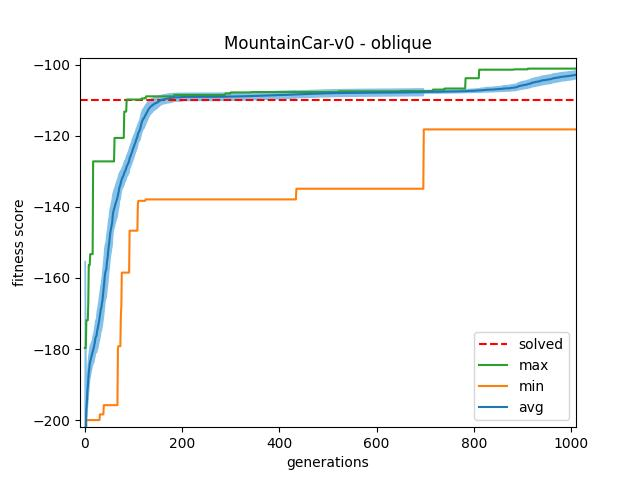
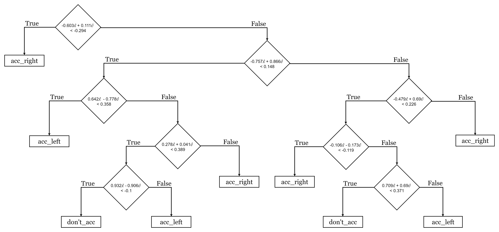
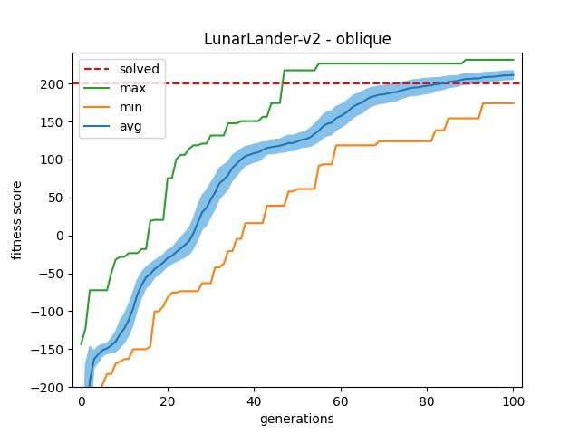
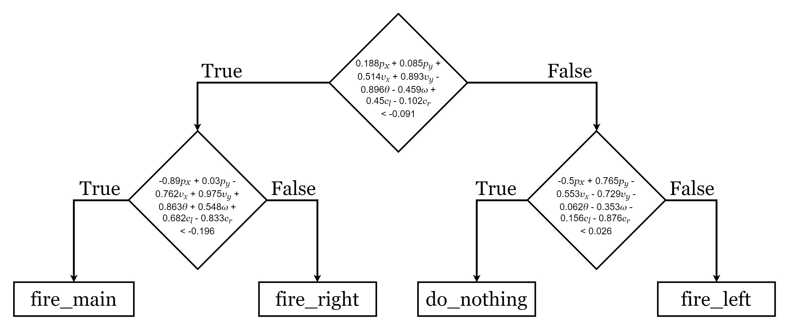

# IAI-GE-Q-DTs
Reimplementation of the paper ["Evolutionary learning of interpretable decision trees"](https://arxiv.org/pdf/2012.07723v3.pdf) by Leonardo Lucio Custode, Giovanni Iacca.

Project members: Chris Kalfar, Lennart Rosseburg

---

## Installation guide

1. Install the open-source-distribution [anaconda](https://www.anaconda.com/products/individual).
2. Use python 3.9.2. We recommend working inside a conda environment.
    ```
    conda create -n RL-project python=3.9.2
    conda activate RL-project
    ```
3. Install requirements with `pip install -r requirements.txt`.
4. To use LunarLander-v2 execute the following commands:
    ```
    conda install swig
    pip install gym[Box2D]
    ```
5. Execute training or evaluation command(s) of your choice.

## Software Versions
- python==3.9.2
- gym==0.21.0
- numpy==1.22.1
- matplotlib==3.5.1
- deap==1.3.1

---

## Used Techniques
Evolutionary algorithm (Grammatical Evolution) with Q-learning.

## Hyperparameter decisions
Hyperparameters were derived from the original paper to examine reproducibility.

## Environments
### CartPole-v1
##### Observation Space
- *x* ∈ [−4.8, 4.8]m : Cart position
- *v* ∈ ]−∞, ∞[m/s   : Cart velocity
- *θ* ∈ [−0.418, 0.418]rad : Pole angle
- *ω* ∈ ]−∞, ∞[rad/s : Pole angular velocity

##### Action space
- 0 : Push cart to the left
- 1 : Push cart to the right

### MountainCar-v0
##### Observation Space
- *x* ∈ [−1.2, 0.6]m : Horizontal position of the car
- *v* ∈ [−0.07, 0.07]m/s : Horizontal velocity of the car

##### Action space
- 0 : Accelerate to the left
- 1 : Don't accelerate
- 2 : Accelerate to the right

### LunarLander-v2
##### Observation Space
- *p<sub>x</sub>* : Horizontal position
- *p<sub>y</sub>* : Vertical position
- *v<sub>x</sub>* : Horizontal velocity
- *v<sub>y</sub>* : Vertical velocity
- *θ* : Angle w.r.t. the vertical axis
- *ω* : Angular velocity
- *c<sub>l</sub>* : Left leg contact
- *c<sub>r</sub>* : right leg contact

##### Action space
- 0 : Do nothing
- 1 : Fire left orientation engine
- 2 : Fire main engine
- 3 : Fire right orientation engine

---

## Argument explanations
- **--grammar:** The grammar that will be used
- **--environment_name:** The name of the environment in the OpenAI Gym framework
- **--n_actions:** The number of action that the agent can perform in the environment
- **--learning_rate:** The learning rate to be used for Q-learning.
- **--df:** The discount factor used for Q-learning
- **--eps:** Epsilon parameter for the epsilon greedy Q-learning
- **--input_space:** The number of environment variables
- **--epsiodes:** The number of episodes that the agent faces in the fitness evaluation phase
- **--episode_length:** The max length of an episode in timesteps
- **--population_size:** The population size
- **--generations:** The number of generations
- **--cxp:** The crossover probability
- **--mp:** The mutation probability
- **--mutation:** The mutation operator. A String in the format: function-value#function_param_-value_1... The operators from the DEAP library can be used by setting the function to 'function-tools.<operator_name>'.
- **--genotype_len:** The fixed-length of the genotype
- **--low:** Lower bound for the random initialization of all leaves q-values
- **--up:** Upper bound for the random initialization of all leaves q-values
- **--decay:** The decay factor for the epsilon decay (eps_t = eps_0 * decay^t). Only used with oblique grammar.
- **--with_bias:** If used, then the conditions will be '(sum ...) < <const>', otherwise '(sum ...) < 0'. Only used with oblique grammar.
- **--types:** This string must contain the range of constants for each environment variable in the format '#min_0,max_0,step_0,divisor_0;...;min_n,max_n,step_n,divisor_n'. All the numbers must be integers.
- **--randInit:** The initialization strategy for q-values. True=Random

---

## Training
### Results
#### CartPole-v1
##### Orthogonal



##### Oblique



#### MountainCar-v0
##### Orthogonal



##### Oblique



#### LunarLander-v2
##### Oblique




### Commands
#### CartPole-v1
##### Orthogonal
```
python test_evolution.py --grammar orthogonal --environment_name CartPole-v1 --seed 7 --n_actions 2 --learning_rate 0.001 --df 0.05 --input_space 4 --episodes 10 --population_size 200 --generations 100 --cxp 0 --mp 1 --low -1 --up 1 --genotype_len 1024 --types #-48,48,5,10;-50,50,5,10;-418,418,5,1000;-836,836,5,1000 --mutation "function-tools.mutUniformInt#low-0#up-40000#indpb-0.1"
```    
```
python test_evolution.py --grammar orthogonal --environment_name CartPole-v1 --seed 9 --n_actions 2 --learning_rate 0.001 --df 0.05 --input_space 4 --episodes 10 --population_size 200 --generations 100 --cxp 0 --mp 1 --low -1 --up 1 --genotype_len 1024 --types #-48,48,5,10;-50,50,5,10;-418,418,5,1000;-836,836,5,1000 --mutation "function-tools.mutUniformInt#low-0#up-40000#indpb-0.1"
```
```
python test_evolution.py --grammar orthogonal --environment_name CartPole-v1 --seed 2 --n_actions 2 --learning_rate 0.001 --df 0.05 --input_space 4 --episodes 10 --population_size 200 --generations 100 --cxp 0 --mp 1 --low -1 --up 1 --genotype_len 1024 --types #-48,48,5,10;-50,50,5,10;-418,418,5,1000;-836,836,5,1000 --mutation "function-tools.mutUniformInt#low-0#up-40000#indpb-0.1"
```

> **Specs used in training:** \
> CPU = Intel(R) Core(TM) i5-6200U CPU @ 2.30GHz \
> RAM = 8,0 GB DDR3 \
> OS = Windows 10 \
> Duration: 00:33:40 (seed 7) ; 00:24:11 (seed 9) ; 00:38:02 (seed 2) 

##### Oblique
```
python test_evolution.py --grammar oblique --environment_name CartPole-v1 --seed 9 --n_actions 2 --learning_rate 0.001 --df 0.05 --input_space 4 --episodes 10 --population_size 200 --generations 50 --cxp 0 --mp 1 --low -1 --up 1 --genotype_len 100 --types #-48,48,5,10;-50,50,5,10;-418,418,5,1000;-836,836,5,1000 --mutation "function-tools.mutUniformInt#low-0#up-4000#indpb-0.1"`
```
```
python test_evolution.py --grammar oblique --environment_name CartPole-v1 --seed 2 --n_actions 2 --learning_rate 0.001 --df 0.05 --input_space 4 --episodes 10 --population_size 200 --generations 50 --cxp 0 --mp 1 --low -1 --up 1 --genotype_len 100 --types #-48,48,5,10;-50,50,5,10;-418,418,5,1000;-836,836,5,1000 --mutation "function-tools.mutUniformInt#low-0#up-4000#indpb-0.1"`
```
```
python test_evolution.py --grammar oblique --environment_name CartPole-v1 --seed 7 --n_actions 2 --learning_rate 0.001 --df 0.05 --input_space 4 --episodes 10 --population_size 200 --generations 50 --cxp 0 --mp 1 --low -1 --up 1 --genotype_len 100 --types #-48,48,5,10;-50,50,5,10;-418,418,5,1000;-836,836,5,1000 --mutation "function-tools.mutUniformInt#low-0#up-4000#indpb-0.1"`
```

> **Specs used in training:** \
> CPU = Intel(R) Core(TM) i5-6200U CPU @ 2.30GHz \
> RAM = 8,0 GB DDR3 \
> OS = Windows 10 \
> Duration: 00:21:31 (seed 7) ; 00:12:00 (seed 9) ; 00:23:09 (seed 2) 

#### MountainCar-v0
##### Orthogonal
```
python test_evolution.py --grammar orthogonal --environment_name MountainCar-v0 --seed 7 --n_actions 3 --learning_rate 0.001 --df 0.05 --input_space 2 --episodes 10 --population_size 200 --generations 1000 --cxp 0 --mp 1 --low -1 --up 1 --genotype_len 1024 --types #-120,60,5,100;-70,70,5,1000 --mutation "function-tools.mutUniformInt#low-0#up-40000#indpb-0.05"`
```
```
python test_evolution.py --grammar orthogonal --environment_name MountainCar-v0 --seed 9 --n_actions 3 --learning_rate 0.001 --df 0.05 --input_space 2 --episodes 10 --population_size 200 --generations 1000 --cxp 0 --mp 1 --low -1 --up 1 --genotype_len 1024 --types #-120,60,5,100;-70,70,5,1000 --mutation "function-tools.mutUniformInt#low-0#up-40000#indpb-0.05"`
```
```
python test_evolution.py --grammar orthogonal --environment_name MountainCar-v0 --seed 2 --n_actions 3 --learning_rate 0.001 --df 0.05 --input_space 2 --episodes 10 --population_size 200 --generations 1000 --cxp 0 --mp 1 --low -1 --up 1 --genotype_len 1024 --types #-120,60,5,100;-70,70,5,1000 --mutation "function-tools.mutUniformInt#low-0#up-40000#indpb-0.05"`
```
    
> **Specs used in training:** \
> CPU = Intel(R) Core(TM) i5-6200U CPU @ 2.30GHz \
> RAM = 8,0 GB DDR3 (1600MHz) \
> OS = Windows 10 \
> Duration: 13:50:23 (seed 7) ; 14:17:05 (seed 9) ; 14:28:24 (seed 2) 

##### Oblique
```
python test_evolution.py --grammar oblique --environment_name MountainCar-v0 --seed 7 --n_actions 3 --learning_rate 0.001 --df 0.05 --input_space 2 --episodes 10 --population_size 200 --generations 2000 --cxp 0.1 --mp 1 --low -1 --up 1 --eps 0.01 --genotype_len 100 --types #-120,70,5,100;-70,70,5,1000 --mutation "function-tools.mutUniformInt#low-0#up-40000#indpb-0.1"`
```
```
python test_evolution.py --grammar oblique --environment_name MountainCar-v0 --seed 9 --n_actions 3 --learning_rate 0.001 --df 0.05 --input_space 2 --episodes 10 --population_size 200 --generations 2000 --cxp 0.1 --mp 1 --low -1 --up 1 --eps 0.01 --genotype_len 100 --types #-120,70,5,100;-70,70,5,1000 --mutation "function-tools.mutUniformInt#low-0#up-40000#indpb-0.1"`
```
```
python test_evolution.py --grammar oblique --environment_name MountainCar-v0 --seed 2 --n_actions 3 --learning_rate 0.001 --df 0.05 --input_space 2 --episodes 10 --population_size 200 --generations 2000 --cxp 0.1 --mp 1 --low -1 --up 1 --eps 0.01 --genotype_len 100 --types #-120,70,5,100;-70,70,5,1000 --mutation "function-tools.mutUniformInt#low-0#up-40000#indpb-0.1"`
```

> **Specs used in training:** \
> CPU = AMD Ryzen 5 5600x \
> RAM = 32GB DDR4 (3600MHz) \
> OS = Windows 10 \
> Duration: 10:10:26 (seed 7) ; 10:06:38 (seed 9) ; 09:30:22 (seed 2) 

#### LunarLander-v2
##### Oblique
```
python test_evolution.py --grammar oblique --environment_name LunarLander-v2 --seed 5 --n_actions 4 --learning_rate "auto" --df 0.9 --input_space 8 --episodes 1000 --population_size 100 --generations 100 --cxp 0.1 --mp 1 --low -1 --up 1 --eps 1.0 --genotype_len 100 --randInit False --with_bias False --types #-000,1001,1000,1000;-00,1001,1000,1000;-00,1001,1000,1000;-00,1001,1000,1000;-00,1001,1000,1000;-00,1001,1000,1000;-00,1001,1000,1000;-00,1001,1000,1000 --mutation "function-tools.mutUniformInt#low-0#up-40000#indpb-0.05"`
```
```
python test_evolution.py --grammar oblique --environment_name LunarLander-v2 --seed 2 --n_actions 4 --learning_rate "auto" --df 0.9 --input_space 8 --episodes 1000 --population_size 100 --generations 100 --cxp 0.1 --mp 1 --low -1 --up 1 --eps 1.0 --genotype_len 100 --randInit False --with_bias False --types #-000,1001,1000,1000;-00,1001,1000,1000;-00,1001,1000,1000;-00,1001,1000,1000;-00,1001,1000,1000;-00,1001,1000,1000;-00,1001,1000,1000;-00,1001,1000,1000 --mutation "function-tools.mutUniformInt#low-0#up-40000#indpb-0.05"`
```
```
python test_evolution.py --grammar oblique --environment_name LunarLander-v2 --seed 9 --n_actions 4 --learning_rate "auto" --df 0.9 --input_space 8 --episodes 1000 --population_size 100 --generations 100 --cxp 0.1 --mp 1 --low -1 --up 1 --eps 1.0 --genotype_len 100 --randInit False --with_bias False --types #-000,1001,1000,1000;-00,1001,1000,1000;-00,1001,1000,1000;-00,1001,1000,1000;-00,1001,1000,1000;-00,1001,1000,1000;-00,1001,1000,1000;-00,1001,1000,1000 --mutation "function-tools.mutUniformInt#low-0#up-40000#indpb-0.05"`
```

> **Specs used in training:** \
> CPU = AMD Ryzen 5 5600x \
> RAM = 32GB DDR4 (3600MHz) \
> OS = Windows 10 \
> Duration: 39:12:15 (seed 5) ; 12:50:23 (seed 9) ; 04:42:04 (seed 2) 

---

## Evaluation
### Results 
> **Setting:** 1000 runs, each on a different seed
>
> **CartPole-v1 - orthogonal:** Mean = 491.758 ; Std = 20.267102308914314 \
> **CartPole-v1 - oblique:** Mean = 498.066 ; Std = 12.5313065559821 \
> **MountainCar-v0 - orthogonal:** Mean = -99.305 , Std = 7.708305585535644 \
> **MountainCar-v0 - oblique:** Mean = -101.14 ; Std = 8.84976835855041 \
> **LunarLander-v2 - oblique:** Mean = 249.18271913727554 ; Std = 26.977546731623335

### Commands
```
python evaluation.py --environment CartPole-v1 --grammar orthogonal --seed 7 --n_runs 1000
```
```
python evaluation.py --environment CartPole-v1 --grammar oblique --seed 7 --n_runs 1000
```
```
python evaluation.py --environment MountainCar-v0 --grammar orthogonal --seed 7 --n_runs 1000
```
```
python evaluation.py --environment MountainCar-v0 --grammar oblique --seed 7 --n_runs 1000
```
```
python evaluation.py --environment LunarLander-v2 --grammar oblique --seed 5 --n_runs 1000
```

---

## Links
- [Paper](https://arxiv.org/pdf/2012.07723.pdf)
- [Codebase of paper](https://gitlab.com/leocus/ge_q_dts)
- [Wikilink: Grammatical evolution](https://en.wikipedia.org/wiki/Grammatical_evolution)
- [DEAP Library](https://github.com/deap/deap)

## Project Guidelines
- [Reproducibility Checklist](checklist_reproducibility.jpg)
- [Lecture Powerpoint](https://studip.uni-hannover.de/sendfile.php?type=0&file_id=f59cece59252733b699685dd73438268&file_name=RL_lecture_exam_21_22.pdf)
